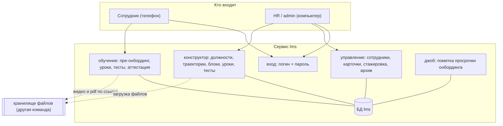
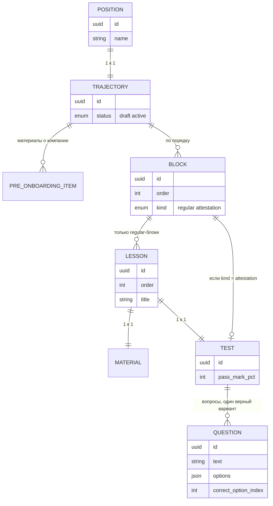
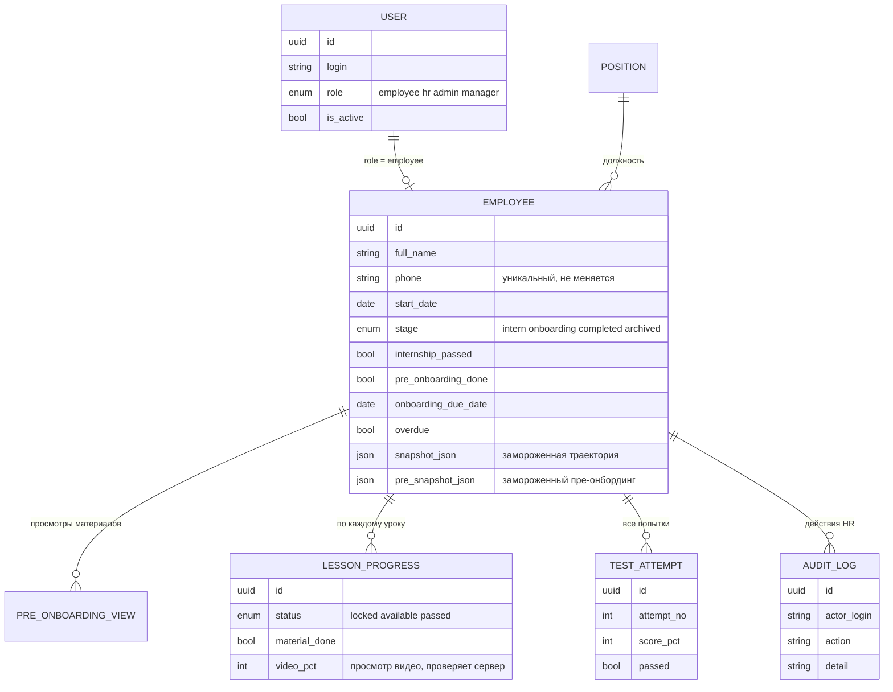
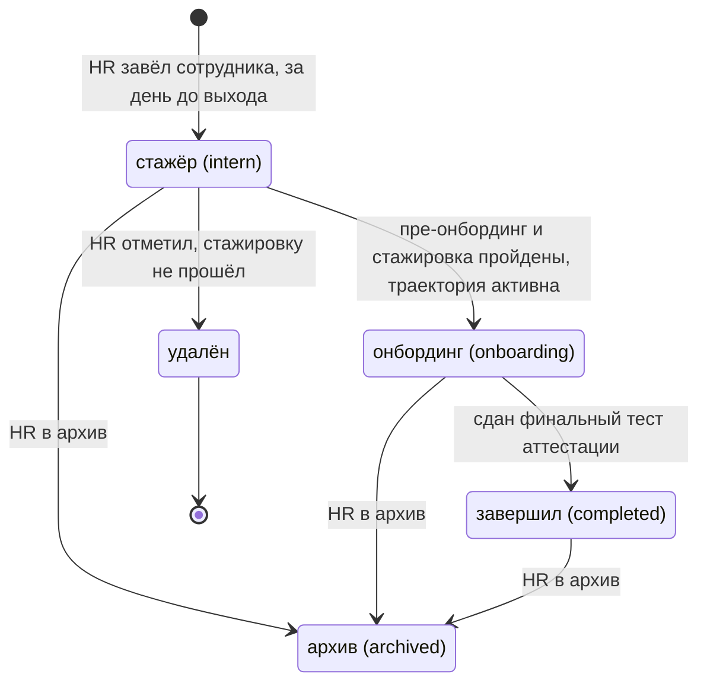
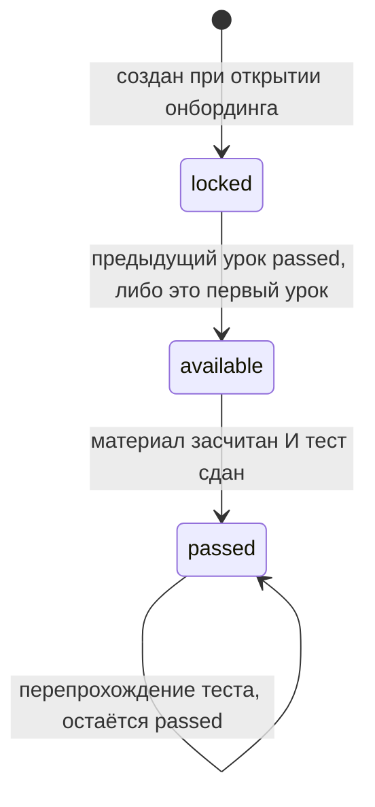
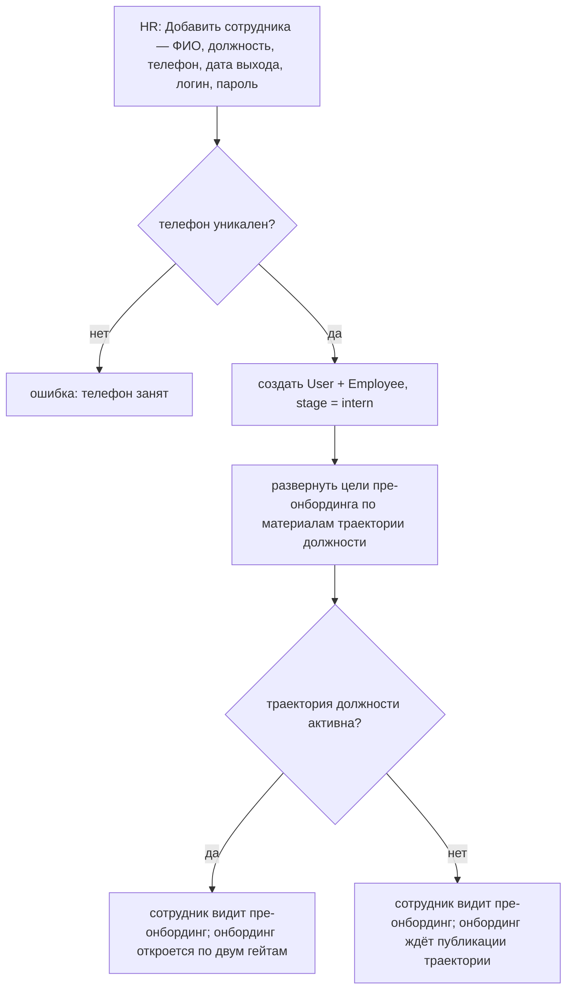
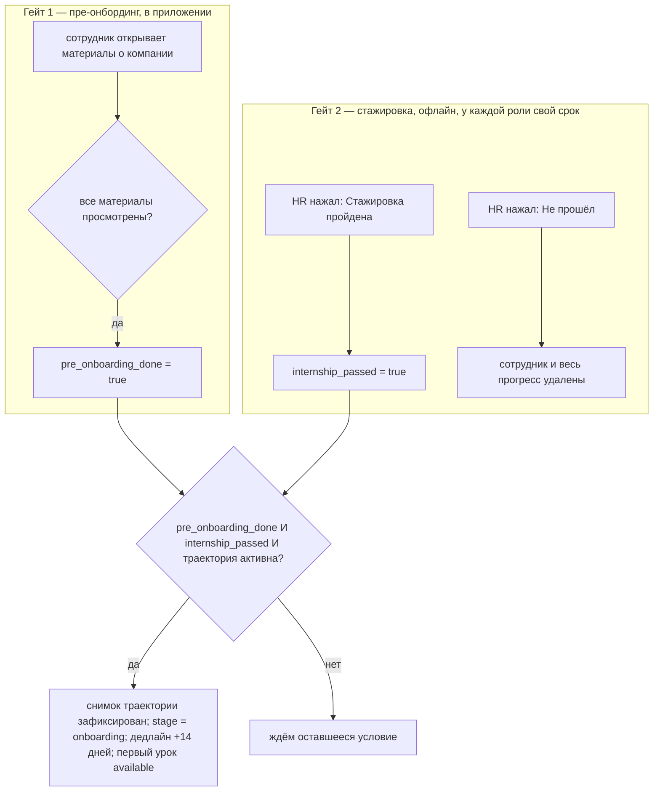
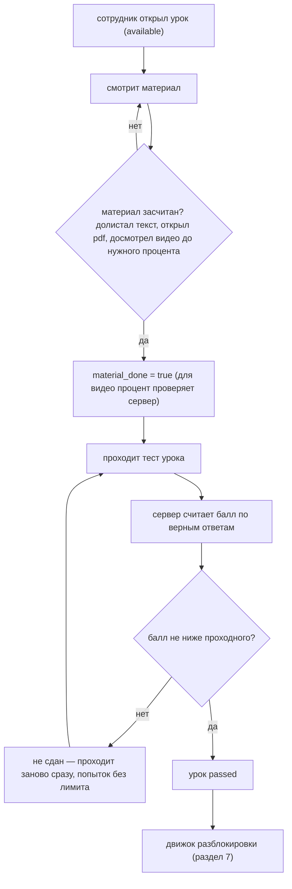
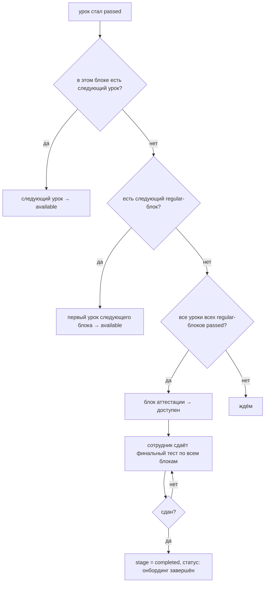
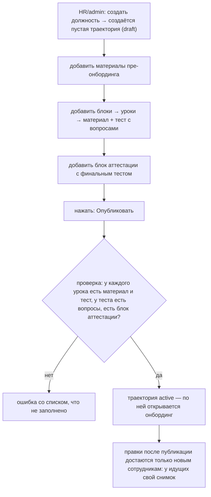

# PEG HR LMS v1 — логика работы

Как работает система. Точные поля и API — в `SPEC.md`, экраны — в `DESIGN.md`.
Диаграммы — mermaid (рендерятся на GitHub и в предпросмотре Markdown).
Готовые картинки — папка `diagrams/`.

---

## Идея

Онбординг новичка — это **линейный проход по урокам**, где урок = «материал + тест
по нему». Один движок: закрыл урок — открылся следующий. Дошёл до конца —
финальный тест-аттестация — статус «завершил».

Четыре решения:

1. **Урок = пара материал + тест.** Урок пройден, когда материал засчитан и тест
   сдан. Тесты без лимита попыток, пересдача сразу — «провала» как состояния нет.
2. **Два гейта открывают онбординг:** пройден весь пре-онбординг (материалы о
   компании) И HR подтвердил кнопкой, что стажировка (офлайн) пройдена.
   Оба обязательны, порядок между ними не важен.
3. **Снимок траектории.** При открытии онбординга структура (блоки, уроки,
   материалы, тесты, вопросы с ответами) копируется сотруднику. Дальше он учится
   только по своей копии — правки каталога не могут сломать того, кто уже в пути;
   они достаются только новым назначениям.
4. **Один сервис, одна БД.** Внутри — модули: вход, обучение, управление,
   конструктор, джобы.

Всё движение сотрудника — это одна машина состояний `Employee.stage`
(`intern → onboarding → completed → archived`), которую двигают действия HR и
прогресс по урокам.

---

## 1. Карта системы

---

## 2. Данные

### 2.1 Контент — траектория должности

### 2.2 Люди и прогресс

---

## 3. Машины состояний

### 3.1 Сотрудник — Employee.stage

### 3.2 Урок — LessonProgress.status

---

## 4. Найм → стажёр

---

## 5. Два гейта → открытие онбординга

---

## 6. Прохождение урока

---

## 7. Разблокировка и аттестация

Просрочка: если дедлайн (14 дней) прошёл, а онбординг не завершён — у HR в списке
пометка «просрочено». Доступ не режется, сотрудник доучивается.

---

## 8. Конструктор контента

---

## 9. Как ложится на сборку

| Шаг | Что делаем | Диаграммы |
|---|---|---|
| 1 | Каркас: вход (логин/пароль, роли), сущности, БД | 1, 2 |
| 2 | Конструктор: должности, траектория, блоки, уроки, материал+тест, публикация | 2.1, 8 |
| 3 | Найм + пре-онбординг: карточка сотрудника, экран пре-онбординга, отметки просмотра | 3.1, 4, 5 (гейт 1) |
| 4 | Открытие онбординга: кнопка HR «Стажировка пройдена», разворот уроков | 5, 3.1 |
| 5 | Обучение: экран траектории, экран урока, тесты, движок разблокировки | 3.2, 6, 7 |
| — | Всё обучение читается из снимка сотрудника, а не из живого каталога | 2.2, 5, 8 |
| 6 | Аттестация + завершение + пометка просрочки | 7 |

Каждое ветвление на схемах и каждый переход состояний — это тест-кейс. Точные
условия — правила `R-*` и `C-*` в `SPEC.md`.
